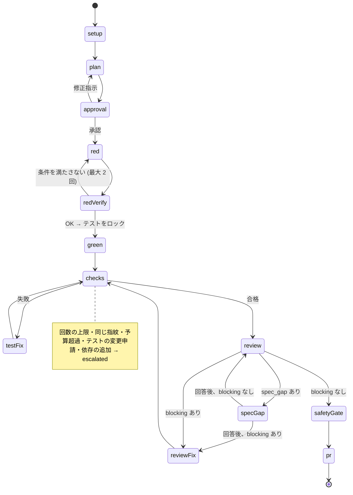

# opencode ハーネス 実装計画（v3.3）

- 作成日: 2026-09-25 / 改訂: 2026-09-26（v3.1: M0 の結果を反映）、2026-09-27（v3.2: spec_gap の記録の方法）、2026-09-28（v3.3: 対象環境を Raspberry Pi に変更）
- 対象: opencode 1.18.x / Raspberry Pi（Linux、arm64）/ gh 2.96
- M0 のスパイクと M1 の E2E は Windows 11 で確かめた（[docs/spikes.md](spikes.md)、[docs/e2e/m1.md](e2e/m1.md)）。M2 以降は Raspberry Pi だけを対象にする（決定 13）

## 0. 変更履歴

| 版 | 内容 |
|---|---|
| v1 | 外部の Runner CLI が工程を進める構成 |
| v2 | TUI 中心に変更。決定的な処理を opencode のプラグインとカスタムツールに組み込む。240k トークンでの圧縮 |
| v3 | レビューで挙がった 23 項目を反映。主な変更は次のとおり。**テストを書く役と実装する役を分け、テストファイルをロックする**。git の書き込みはハーネスだけが行う。進展のないループを早めに止める。免除リスト。spec_gap の経路。issue ごとの worktree。ベースラインの確認。完了の定義を lint / 型 / ビルド / 全テストまで広げる。トークンとコストの予算。PR 後のフィードバック対応。ハーネス自体の評価。マイルストーンを「先に一本道を通す」形に変更 |
| v3.1 | M0 の結果（[docs/spikes.md](spikes.md)）を反映。上限の検知を「エラー」から「`session.status` の retry」に変更。対話中の司令塔も自動でモデルを切り替える。モデルの疎通の確認を追加。権限は子セッションの作成時に動的に渡す。子セッションへの依頼は `prompt_async` とイベントで待つ。レビューのキャッシュの工夫を削除 |
| v3.2 | spec_gap の回答を `harness_answer` ではなく `harness_record`（gate: `spec_gap`）で記録する形に変更。issue へのコメントは下書きまでとし、投稿しない（#38） |
| v3.3 | 対象環境を Windows 11 から Raspberry Pi（Linux、arm64）だけに変更。リスクの表を見直す（決定 13） |

---

## 1. 前提として確認した事実

| 項目 | 確認結果 | 設計への影響 |
|---|---|---|
| カスタムツール | プラグインが `tool: { name: tool({...}) }` の形でツールを追加できる。context には `sessionID` / `agent` / `directory` / `worktree` がある | 状態機械を、LLM から呼べる決定的な関数として実装する |
| プラグインの SDK | プラグインは `client` を受け取る。`session.create` / `session.prompt({ body: { model, parts, ... } })` / `session.abort` / イベントの購読が使える | ツールの中から、工程ごとの子セッションをモデルを指定して実行する |
| モデルのフォールバック | 組み込みの仕組みはない。ただし、プロンプトごとに `model` を指定でき、同じセッションの途中で替えても会話は引き継がれる（M0-5） | プラグインが上限を検知し、同じセッションを別のモデルで続ける。子セッションでも、対話中の司令塔のセッションでも同じ |
| 上限の現れ方 | **エラーにならない**。opencode は上限を「リトライ可能」として扱い、`retry-after`（数時間〜数日）だけ待ち続ける。`session.status` が `{ type: "retry", action.reason: "account_rate_limit", next }` になる（M0-3） | `session.status` を購読して検知し、abort してから切り替える（6.1） |
| セッションごとの権限 | `POST /session` の body で `permission` ルールを渡せる（M0-7） | テストのロックや worktree の許可は、子セッションの作成時に動的に渡す |
| コマンド | frontmatter で `agent` / `model` を指定できる | 対話する工程の初期モデルは、コマンドの frontmatter で決める |
| 自動圧縮 | 使用トークン数が `limit.input - compaction.reserved` 以上になると始まる。`limit.input` の上書きが効くことを実機で確認した（M0-6） | `limit.input` を上書きして、240k で圧縮させる |
| OpenCode Go / Codex | `opencode-go/*` と `openai/*`。**OpenCode Go は 2026-09-26 時点で月間上限に到達済み**（10-13 ごろにリセット）。Codex では使えないモデルがある（`gpt-5.4` 系、`gpt-5.3-codex-spark`）。Codex のコストは常に 0 と表示される | 当面は Codex だけで動かす前提で M1 を進める。設定の検証でモデルの疎通を確かめる。予算はトークン数で管理する |
| 長い HTTP 呼び出し | 応答まで接続を開いたまま待つ呼び出しは、クライアント側の制限（Node の fetch は 5 分）で切れる。切れてもサーバ側の処理は続く（M0-2） | 子セッションへの依頼は `prompt_async` で送り、完了は `session.idle` のイベントで受け取る |

### M0（スパイク）の結果
詳細は [docs/spikes.md](spikes.md)。

| # | 確かめたこと | 結果 |
|---|---|---|
| 1 | `agent` の指定 | ✅ |
| 2 | ツールの長時間実行 / 中断の伝達 | ✅ 31 分 40 秒の実行が完了。中断も約 13 秒でツールに届く（完了直後にも abort が発火するので区別する） |
| 3 | 上限の現れ方 | ✅ 判明（エラーではなく retry で待ち続ける） |
| 4 | 子セッションの `ask` | ⚠️ 応答まで止まる。TUI での表示は未確認（作業用エージェントでは `ask` を使わないので影響なし） |
| 5 | 途中でモデルを替える | ✅ 会話も引き継がれる |
| 6 | `limit.input` による圧縮 | ✅ |
| 7 | worktree を作業場所にする | ✅ `external_directory` の許可を渡す必要がある |
| 8 | トークン数とコスト | ✅（Codex はコストが 0） |
| 9 | 自動継続 | ✅ agent とモデルの明示が必要 |
| 10 | セッション間のキャッシュ | ❌ 効かない（同じセッションの中だけ） |

## 2. 全体アーキテクチャ

```
┌─ opencode TUI（ユーザーはここだけを操作する）──────────────────────────────┐
│  ユーザー: 「issue 12 を開発して」 or /dev 12                               │
│  ┌──────────────────────────────┐                                           │
│  │ 司令塔（primary）            │ 自然言語を解釈してツールを呼ぶ             │
│  │ harness / harness-fix        │ question ツールでユーザーと対話する        │
│  └──────┬───────────────────────┘                                           │
│         │ ツール呼び出し                  ▲ session.idle で自動継続（M0-9） │
│  ┌──────▼───────────────────────────────────────────────────────────────┐  │
│  │ harness プラグイン（決定的なコード）                                 │  │
│  │ 状態機械 / 状態の永続化とロック / 子セッションの実行とフォールバック │  │
│  │ テストの実行と解析（JUnit）/ テストのロック / 差分の監査              │  │
│  │ git（worktree・commit）/ gh（issue・PR）/ 予算 / 圧縮の設定の同期     │  │
│  └──────┬───────────────────────────────────────────────────────────────┘  │
│         │ session.create(parentID, directory = worktree) + prompt(agent, model)
│  ┌──────▼─────────┐ ┌───────────────┐ ┌──────────────┐ ┌──────────────┐    │
│  │ 子: test-writer│ │ 子: implementer│ │ 子: reviewer×3│ │ 子: judge   │ …  │
│  └────────────────┘ └───────────────┘ └──────────────┘ └──────────────┘    │
└────────────────────────────────────────────────────────────────────────────┘
      工程間の受け渡しは md の成果物だけ（docs/requirements/, <worktree>/.harness/run/）
```

### 基本原則
1. **操作は TUI だけで完結する**: 自然言語でも、スラッシュコマンドでも進められる。
2. **LLM に数えさせない**: ループの回数、遷移、GitHub 操作、git の書き込みは、プラグインのコードで行う。
3. **レビューで見つけるより、権限で防ぐ**: テストのロック、git の書き込み禁止、依存の追加の検知など、防げるものはコードと権限で防ぐ。レビューは、その網をすり抜けたものを拾う二段目にする。
4. **セッションの独立**: 作業はすべて子セッションで行う。子セッションに渡すのは成果物のパスだけ。
5. **完了マーカーと冪等性**: 成果物の frontmatter に `status: done` と、工程の結果を書く。どの工程も再実行してよい作りにする。
6. **早めに人に渡す**: 進展がない、仕様が曖昧、テストの変更が必要、危険な変更がある。こうした場合は、ループを使い切る前に人に渡す。

## 3. 操作方法

### 3.1 スラッシュコマンド

| コマンド | 司令塔 | 内容 |
|---|---|---|
| `/req <概要 or slug>` | harness | 要件定義を開始する。既存の slug なら**変更要求**として差分だけを扱う（8.1） |
| `/dev <issue番号>` | harness | 開発を開始・再開する |
| `/fix <issue番号>` | harness-fix | エスカレーションされた issue、または **PR 後のフィードバック（CI の失敗やレビューコメント）** に、対話しながら対応する |
| `/resume` | harness | 中断した run（`interrupted` / `waiting_quota` / `auth_required` を含む）を一覧し、選んだものを再開する |
| `/status` | harness | run ごとの状態、ループ回数、トークンとコスト、プロバイダの上限状態 |

工程ごとに新しいセッションで始めることを推奨する（`/new` → `/dev 12`）。状態はすべて成果物に書かれているので、どのセッションからでも続きを実行できる。

### 3.2 自然言語の例

| 例 | 司令塔の動作 |
|---|---|
| 「ユーザー招待機能を作りたい」 | `harness_start(kind: "req")` |
| 「issue 12 を進めて」「続きをやって」 | `harness_status` → `harness_advance` |
| 「その指摘は対応しなくていい」 | `harness_waive`（免除リストに追加する） |
| 「その仕様は、期限切れなら 404 を返すのが正しい」 | `harness_record`（gate: `spec_gap`。spec_gap への回答を記録する） |
| 「PR にレビューコメントが付いたので対応して」 | `/fix` と同じ流れ（PR フィードバックモード） |

## 4. プラグインが提供するツール

| ツール | 内容 |
|---|---|
| `harness_start(kind, arg)` | run を作る（`req` / `dev`）。すでにあれば既存の run を返す。`fix` のときは run を作らず、エスカレーションした run の報告の要約と方針の選択肢を返す（エスカレーションしていなければ何もしない） |
| `harness_status(runId?)` | 状態、工程、ループ回数、トークンとコスト、次にやること |
| `harness_advance(runId)` | 自動で進められる工程を 1 つ実行する。戻り値は `continue` / `need_user`（何を聞くか、読むべき成果物）/ `escalated`（理由の種類）/ `waiting_quota`（再開できる時刻）/ `done` のいずれか |
| `harness_record(runId, gate, decision, feedback?)` | 承認・修正指示・中断など、ユーザーの判断を記録する。spec_gap への回答もこのツールで記録する（gate: `spec_gap`、decision: `answered`、feedback に回答）。回答は `04-decisions.md` に追記し、issue へのコメントは `issue-comment-draft.md` に下書きを作るだけで投稿しない |
| `harness_waive(runId, findingId, reason)` | 指摘を免除リストに追加する |
| `harness_models()` | 工程ごとのモデルと、プロバイダの上限状態 |

- 1 回の呼び出しで 1 工程だけを進める（タイムアウトを避け、進み具合を見せるため）。
- **自動継続**: `continue` を返したとき、プラグインが司令塔のセッションの `session.idle` を検知して、「harness_advance を続けて」と自動で送る（M0-9 で確認済み）。LLM がツールを呼び続けてくれるかどうかに頼らないため。ユーザーが Esc で止めた場合や、`need_user` の後は送らない。**agent を省くと既定の `build` になってしまうので、送るときは司令塔の agent とモデルを必ず指定する**。
- **子セッションの実行方法**: 子セッションへの依頼は `prompt_async` で送り、完了は `session.idle` のイベントで受け取る。応答が返るまで HTTP の接続を開いたまま待つと、クライアント側の制限（5 分）で切れるため（M0-2）。待っている間は、ツールの `context.metadata` で進み具合（工程、経過時間、トークン数）を TUI に表示する。
- **中断**: ユーザーが Esc で司令塔を止めると、ツールの `context.abort` に届く（M0-2 で確認済み）。ツールはそれを受けて、実行中の子セッションも `session.abort` で止め、状態を `interrupted` にして保存する。

## 5. ディレクトリ構成

```
.opencode/
  package.json                    # @opencode-ai/plugin
  plugins/harness.ts              # エントリ（tools / event / compacting フック）
  harness/                        # 本体（純粋な TS。SDK クライアントは差し替えてテストする）
    config.ts  state.ts  lock.ts  session.ts  models.ts  budget.ts  artifacts.ts
    machine/{req,dev,fix}.ts
    testing/{runner,junit,fingerprint,lock,flaky}.ts
    audit/{deps,secrets,issue-drift}.ts
    github.ts  git.ts  sync.ts     # sync: 権限、圧縮、コマンドのモデルを設定から生成する
    test/
  agents/  commands/  templates/
.github/ISSUE_TEMPLATE/{feature-task,epic}.md, pull_request_template.md
harness.config.json
docs/requirements/<slug>/         # 要件定義の成果物（git 管理）
.harness/                         # メインのリポジトリ側（gitignore）
  provider-status.json
  runs/<run-id>/state.json, events.jsonl, lock
eval/                             # ハーネス自体の評価（ゴールデンシナリオ。11 章）
scripts/install.mjs               # 開発対象のリポジトリへの導入
```

### issue ごとの worktree と成果物
- worktree は、リポジトリの外の兄弟ディレクトリ `../<repo>.worktrees/issue-<N>/` に作る。メインのリポジトリの検索結果に混ざらないようにするため。
- 子セッションは `POST /session?directory=<worktree>` で作る。worktree の中で bash を実行すると `external_directory` の確認（ask）が出て止まるので（M0-7）、**子セッションの作成時に `permission` で許可を渡す**。パスの表記が揺れることがあったため、許可のパターンは `*<repo>.worktrees*` のようなワイルドカードにする。
- 開発工程の成果物は、worktree の中の `.harness/run/`（gitignore）に置く。子セッションは、自分の worktree の中だけを見ればよい。

```
<worktree>/.harness/run/
  00-issue.md               # issue のスナップショット（本文のハッシュつき）
  00-baseline.md            # ベースブランチでのチェック結果（もともと失敗しているもの）
  01-plan.md                # テスト計画、実装計画、追加する依存の一覧（approved）
  02-red.md                 # test-writer の記録、Red の確認結果
  test-lock.json            # ロックしたテストファイルとハッシュ
  03-green-log.md           # implementer の記録（テストケースごとのチェックボックス）
  checks/run-<n>.md         # チェックの結果（lint / 型 / ビルド / テスト、指紋、flaky）
  test-fix/<k>.md
  reviews/round-<r>/<観点>.md, summary.md
  review-fix/<k>.md
  waivers.md                # 免除した指摘
  questions/spec-gap-<q>.md # 仕様への質問と回答
  change-requests/test-<c>.md  # テストの変更申請
  escalation-<e>.md  fix-<e>.md  pr-feedback-<n>.md  pr-body.md
  gates/<ゲート名>.md
```

## 6. 設定（harness.config.json）

```jsonc
{
  "providers": {
    "fallbackChain": ["opencode-go", "openai"],
    "limitRetryReasons": ["account_rate_limit", "free_tier_limit"],   // session.status の retry.action.reason
    "limitRetryWaitSec": 120,          // retry の待ち時間がこれより長ければ、理由が分からなくても上限とみなす
    "authErrorPatterns": ["401", "unauthorized", "invalid_grant", "token expired"],
    "cooldownMinutes": 60,             // next が分からないときの再試行の間隔
    "probeModels": true                // 設定の検証で、各モデルの疎通を確かめる
  },
  "models": {
    "chat.req": ["opencode-go/kimi-k3", "openai/gpt-6-sol"],
    "chat.dev": ["opencode-go/glm-5.3-flash", "openai/gpt-6-luna-fast"],
    "chat.fix": ["opencode-go/kimi-k3", "openai/gpt-6-sol"],
    "req.spec": ["opencode-go/glm-5.3", "openai/gpt-6-sol"],
    "req.issue-plan": ["opencode-go/glm-5.3", "openai/gpt-5.5"],
    "dev.plan": ["opencode-go/kimi-k3", "openai/gpt-6-sol"],
    "dev.test-writer": ["opencode-go/glm-5.3", "openai/gpt-6-sol"],
    "dev.implementer": ["opencode-go/kimi-k2.7-code", "openai/gpt-5.5"],
    "dev.test-fix": ["opencode-go/kimi-k2.7-code", "openai/gpt-5.5"],
    "dev.review.spec": ["opencode-go/qwen3.8-max", "openai/gpt-6-sol"],      // 実装役とは別の系統にする
    "dev.review.integrity": ["opencode-go/deepseek-v4-pro", "openai/gpt-6-sol"],  // spec とも別のモデルにする
    "dev.review.advisory": ["opencode-go/glm-5.3", "openai/gpt-5.5"],
    "dev.review-judge": ["opencode-go/glm-5.3", "openai/gpt-6-sol"],
    "dev.review-fix": ["opencode-go/kimi-k2.7-code", "openai/gpt-5.5"],
    "dev.pr": ["opencode-go/glm-5.3-flash", "openai/gpt-6-luna-fast"]
  },
  "steps": {                          // 工程ごとの上限
    "default": { "maxSteps": 60, "timeoutMin": 30 },
    "dev.implementer": { "maxSteps": 150, "timeoutMin": 60 }
  },
  "checks": [                         // 完了の定義。上から順に実行し、すべて通ったら合格
    { "name": "lint", "command": "npm run lint" },
    { "name": "typecheck", "command": "npx tsc --noEmit" },
    { "name": "build", "command": "npm run build" },
    { "name": "test", "command": "npx vitest run --reporter=junit --outputFile=.harness/run/junit.xml",
      "junit": ".harness/run/junit.xml" }   // テスト全体（回帰の確認を含む）
  ],
  "tests": {
    "globs": ["**/*.test.ts", "**/*.spec.ts", "tests/**"],   // テストのロックと権限の生成に使う
    "flakyRetries": 1
  },
  "dependencyManifests": ["package.json", "package-lock.json", "pnpm-lock.yaml"],
  "loops": { "testFix": 3, "reviewFix": 3, "autoFixBudget": 6, "reviewRoundsInHumanMode": 1, "sameFingerprintLimit": 2 },
  "budget": { "maxChildSessionsPerIssue": 40, "maxTokensPerIssue": 5000000, "maxCostUsdPerIssue": 20, "warnAtRatio": 0.8 },
  "context": { "compactAtTokens": 240000, "reserved": 20000, "prune": true },
  "git": { "branch": "feat/{issue}-{slug}", "baseBranch": "main", "worktreeRoot": "../{repo}.worktrees" }
}
```
モデル名は仮置き。Codex 側は、M0 で疎通を確かめたモデル（`gpt-5.5` / `gpt-5.5-fast` / `gpt-5.6-sol` / `gpt-5.6-terra` / `gpt-6-sol` / `gpt-6-luna` / `gpt-6-luna-fast` / `gpt-6-astra`）から選んでいる。**設定の検証**で次の点を確かめる。
- 各モデルに短いプロンプトを送り、使えるかを確かめる（`probeModels`。結果は `.harness/model-probe.json` にキャッシュする）。使えないモデルがあればエラーにする。ただし、上限に達しているプロバイダのモデルは「確認できない」として警告にとどめる。
- `dev.review.spec` / `dev.review.integrity` が、`dev.implementer` と同じ系統のモデルになっている。または、この 2 つが同じモデルになっている。
- `review.perspectives` で、`session: "advisory"` なのに `blocking: true` になっている（エラー）。
- `checks` に JUnit を出力するテストがない。
- `tests.globs` に一致するファイルが 1 つもない。

### 6.1 フォールバック、上限、認証エラー
| 状況 | 動作 |
|---|---|
| 上限に達した | 下の「上限の検知」を参照 |
| **すべてのプロバイダが上限** | run を `waiting_quota`（`resumeAt` = 最も早く解除される時刻）にして止める。`/status` に時刻を表示し、その時刻を過ぎたら `/resume` で続けられる |
| **認証エラー**（`authErrorPatterns`） | 上限とは区別して、run を `auth_required` にする。「`/connect` で再認証してから `/resume`」と案内する |
| その他の一時的なエラー | opencode 自身が短い間隔でリトライする（最大 5 回）。それでも失敗してエラーになったら `interrupted` にする |
| 使えないモデル（400 などの即時エラー） | リトライせず、次のプロバイダのモデルに切り替える。そのモデルは疎通の確認のキャッシュで「使えない」にする |

**上限の検知**（M0-3 で判明した挙動に合わせる）
1. プラグインが、ハーネスが管理するすべてのセッション（子セッションと司令塔のセッション）の `session.status` を購読する。
2. `type: "retry"` になったとき、次のどちらかに当てはまれば「上限到達」と判定する。
   - `action.reason` が `limitRetryReasons` に含まれる
   - 待ち時間（`next - 今`）が `limitRetryWaitSec` より長い
3. `session.abort` でそのセッションを止める（`idle` に戻る）。
4. `provider-status.json` に `limitedUntil = next` を記録する（`next` が分からなければ `cooldownMinutes` 後）。
5. 同じセッションに、次のプロバイダのモデルと、**元と同じ agent** を指定して「中断されたので、成果物と git status を確認して続きから」と送る（M0-5、M0-9）。
6. 以降の工程も、`limitedUntil` を過ぎるまではそのプロバイダを使わない。

### 6.2 対話する工程
- 司令塔の初期モデルは、コマンドの frontmatter で決まる。sync が、設定と上限状態からコマンドの `model` を書き換える。
- **対話の途中で上限に達した場合も、自動で切り替える**。6.1 の手順を司令塔のセッションにも適用し、ユーザーが最後に送ったメッセージへの応答を、fallback のモデルでやり直させる。切り替えたことはトーストで知らせる。
- ただし、TUI の入力欄で選ばれているモデルは変わらないので、ユーザーが次のメッセージを送ると、また上限のモデルで送られる。そのたびに同じ検知で切り替わるが、無駄な待ちを避けるため、トーストで `/models` での切り替えも案内する。

### 6.3 コンテキストの圧縮（240k）
- sync が、設定に出てくる全モデルについて、`opencode.json` に `limit.input = compactAtTokens + reserved` を書く（`context` と `output` は実際の値をそのまま書く）。実際の上限が 240k 以下のモデルは上書きしない。
- `compaction: { auto: true, prune: true, reserved: 20000 }` を設定する。
- `experimental.session.compacting` フックで、圧縮の要約に run の ID、工程、成果物のパス、ループ回数を必ず含める。

## 7. 状態の整合性と再開

| 仕組み | 内容 |
|---|---|
| アトミックな保存 | `state.json` は一時ファイルに書いてから rename する。**ループ回数は工程を始める前に加算して保存する** |
| HEAD の記録 | 工程の開始時と終了時に、worktree の HEAD の SHA を記録する。再開のときに、HEAD や作業ツリーが記録と違えば `need_user` にする（「手で変更がありました。取り込みますか / 戻しますか」） |
| ロック | `runs/<id>/lock` に pid、セッション ID、生存確認の時刻（30 秒ごとに更新）を書く。2 分以上更新されていなければ古いロックとみなす。同じ run を 2 つの TUI で動かせないようにする |
| エージェント定義のハッシュ | 工程ごとに、使ったエージェントの定義ファイルとモデルのハッシュを記録する（再現性と、評価との対応づけのため） |
| 再開の手順 | ① 成果物に `status: done` があれば完了扱い ② なければ、記録している子セッションに「成果物と git status を確認して続きから」と送る ③ 子セッションが使えなければ、新しい子セッションでやり直す |
| 副作用の冪等性 | issue: 番号の書き戻しとタイトル検索。PR: `gh pr list --head`。コード: 工程ごとのチェックポイント commit |

## 8. 工程の詳細

### 8.1 要件定義（`/req`）

```
[司令塔] interview → [子] spec-writer → [司令塔] 承認 → [子] issue-planner → [コード] 検証 → [司令塔] 承認 → [コード] publish
```

| 工程 | 実行者 | 内容 |
|---|---|---|
| interview | 司令塔（question） | Definition of Ready を満たすまで質問する。Q&A は 1 問ごとに `00-interview-log.md` に追記する |
| spec | 子 `spec-writer` | `01-requirements` / `02-user-stories` / `03-glossary` / `04-decisions` / `specs/*` |
| issue-plan | 子 `issue-planner` | `05-issue-plan.md` と `issues/NN-*.md`（縦割り、AC は 1〜3 個、差分 300 行以内が目安） |
| **検証** | **コード** | テンプレートの全セクションが埋まっているか、AC が**ちょうど 1 回ずつ**割り当てられているか、依存関係に循環がないか、タイトルの形式。NG なら、理由を添えて issue-planner の子セッションに差し戻す（最大 2 回） |
| publish | コード | 依存の順に `gh issue create` → `#TBD-NN` を置き換え → 親 issue → 番号を書き戻す |

**変更要求のモード**（既存の slug で `/req` を実行したとき）
- interview では「何を変えるか」だけを聞く。
- spec-writer は、ドキュメントの版を上げて変更履歴を書く。変わった AC には新しい ID を振り、古い AC は `superseded` にする。
- issue-planner は、**新しく追加された AC と変更された AC の分だけ**issue を作る。すでにある issue に影響する場合は、その issue へのコメント案を作る（投稿は承認してから）。

### 8.2 開発（`/dev <issue>`）



| 工程 | 実行者 | 内容 |
|---|---|---|
| setup | コード | ① **依存 issue の確認**: issue の「依存関係」にある issue がまだ開いていれば `need_user`（待つ / 依存先のブランチの上に積む / 無視して進める）② issue の本文をスナップショットし、ハッシュを記録する ③ worktree とブランチを作る ④ **ベースライン**: ベースブランチで `checks` を実行し、もともと失敗しているものを `00-baseline.md` に記録する（以降の判定では除外する） |
| plan | 子 `dev-planner` | テスト計画（ケースごとに対応する AC、正常系・異常系・境界値）、実装計画、**追加する依存の一覧**を `01-plan.md` に書く |
| approval | 司令塔 | 要約を示し、`question` で承認を得る。修正指示なら、planner の子セッションを継続して反映させる |
| red | 子 `test-writer` | 計画のテストケースをすべて書く。コンパイルが通るように、実装側には**シグネチャだけのスタブ**（本体は未実装の例外を投げる）を置いてよい。ロジックは書かない |
| redVerify | コード | テストを実行して JUnit を解析し、次の条件を確かめる。① 計画のテストケースがすべて存在する ② 新しいテストが**アサーションか未実装の例外で**失敗している（import エラーや構文エラーは不可）③ 既存のテストが壊れていない。満たさなければ、理由を添えて test-writer に差し戻す（最大 2 回）。OK なら、**テストファイルのハッシュを `test-lock.json` に記録してロックする** |
| green | 子 `implementer` | ロックされたテストを通す最小のコードを、テストケースごとに書く。`03-green-log.md` のチェックボックスで進み具合を記録する（途中から再開できる）。**テストファイルは編集できない**（権限で deny） |
| checks | コード | `checks` を順に実行する。失敗したテストは `flakyRetries` 回だけ再実行し、再実行で通ったものは flaky として記録する（ループの回数には数えず、PR に載せる）。ベースラインの失敗は除外する。失敗の**指紋**を計算する |
| test-fix | 子 `test-fixer` | 原因を `test-fix/k.md` に書いてから修正する。テストファイルは編集できない。テストのほうが誤っていると判断したら、**テストの変更申請**を書いて終了する |
| review | 子 レビュアー（並列）＋ 子 `review-judge` | 8.4 を参照 |
| review-fix | 子 `review-fixer` | blocking の指摘だけに対応する。テストファイルは編集できない |
| safetyGate | コード → 司令塔 | ① 秘密情報のスキャン（正規表現で）② レビューで `safety_critical` になった指摘 ③ **依存の追加の監査**: `dependencyManifests` の差分を計画の依存一覧と照合する ④ **issue の変更の確認**: 現在の本文のハッシュをスナップショットと比べる。どれかに該当すれば、`question` で人に確認する（直す → `/fix` / 了承して進める / 中断） |
| pr | 子 `pr-writer` → コード | テンプレートに沿って `pr-body.md` を作る（テスト結果、flaky、免除した指摘、blocking でない指摘、トークンとコスト）→ push → `gh pr create --body-file`（`Closes #N`）。**差分が 300 行を超えたら**、PR 本文に警告を載せる |

**テストのロックの守り方（2 段構え）**
1. **権限**: implementer / test-fixer / review-fixer の子セッションを作るときに、`tests.globs` から作った `edit` の deny ルールを `permission` で渡す（M0-7 で、セッションごとに権限を渡せることを確認済み）。harness-fix（司令塔）はセッションの作成時に権限を渡せないため、プラグインの `tool.execute.before` フックで、テストファイル（`tests.globs`）・ハーネスの成果物（修正の記録と変更申請を除く）・秘密情報への編集を拒否する（#41）。
2. **コードでの監査**: 工程が終わるたびに、ロックしたハッシュと照合する。変わっていたら、ハーネスがテストファイルを元に戻し、その工程を失敗として扱う（test-integrity の観点 にも伝える）。

**テストの変更申請**（テストのほうが仕様と合っていない場合）
- `change-requests/test-<c>.md` に、どのテストを・なぜ（根拠となる AC）・どう変えるかを書く。
- エスカレーションして、司令塔が `question` で承認を得る。承認されたら、**test-writer の子セッション**が変更し、ロックを更新する。実装役がテストを変えることはない。

### 8.3 ループと早期エスカレーション

| カウンタ / 検知 | 上限 | リセット | 超えたとき |
|---|---|---|---|
| `testFix` | 3 | fix の後 | エスカレーション |
| `reviewFix` | 3 | しない | エスカレーション |
| `autoFixBudget`（test-fix と review-fix の合計） | 6 | しない | エスカレーション |
| **同じ指紋**（チェックの失敗） | 2 回連続 | — | 3 周を待たずにエスカレーション（`no_progress`） |
| **指摘の再発・揺り戻し** | 一度解消した blocking 指摘が再び出る | — | エスカレーション（`oscillation`） |
| **子セッションの数の予算**（M2） | `budget.maxChildSessionsPerIssue` | しない | 80% で警告、上限に達したら次の子セッションを作らずにエスカレーション（`budget`）。既存の子セッションに続きを送る（再開・書き直しの依頼）ときは数えない |
| **トークン / コストの予算**（M3） | `budget` | しない | 80% で警告、100% でエスカレーション（`budget`） |
| `mode` | — | エスカレーションで `human` にし、戻さない | human モードでは review-fix を自動で実行しない |

- **指紋**: 失敗したテストの ID を並べ替えたものと、メッセージを正規化したもの（数値、パス、行番号を取り除く）のハッシュ。lint や型のエラーは、ルール ID とファイル名から作る。
- **指摘の同一性**: judge が、前回の summary の指摘と照らし合わせて同じ ID を振る。コードは、その ID の出現の履歴で再発を判定する。

### 8.4 多角的レビュー

**方針: ループの判定に関わる観点は、独立したセッションに分ける。参考情報でよい観点は、1 つのセッションに複数のペルソナとしてまとめる。**
- 同じモデルが同じコンテキストでペルソナを演じ分けても、視点は十分に独立しない（最初に見つけた問題に引きずられ、見落としも同じ方向に偏る）。多角的に見るには、ペルソナの数を増やすより、**コンテキストとモデルを分けるほうが効く**。
- 一方で、参考情報にしかならない観点まで別セッションにすると、観点の数だけ diff を読むので、トークンのわりに得るものが少ない。

**セッションの構成**

| セッション | 担当する観点 | 入力 | 分類 | 実行する周 |
|---|---|---|---|---|
| spec（独立） | AC と要件定義書への適合、漏れ、スコープ外の実装 | diff、issue、AC、要件定義書 | `spec_violation` / `spec_gap` / `other` | 毎周 |
| test-integrity（独立） | 捻じ曲げ（ハードコード、テスト専用の分岐、ロジックをモックで消す、計画のテストケースとの対応の欠落） | diff、テストの diff、ロックの監査結果、テスト計画、JUnit の結果 | `test_gaming` / `other` | 毎周 |
| advisory（まとめて 1 つ） | ペルソナ: 品質（可読性、設計、重複）、セキュリティ（入力検証、権限、データの消失）、性能 | diff、関連するソース | `safety_critical` / `other`（NFR への違反は、NFR の ID を根拠に書く） | 1 周目だけ |
| judge | 集約、重複の統合、根拠の検証、前回の指摘との ID の照合、免除リストの適用 | 上の 3 つの結果、前回の summary、`waivers.md` | 最終的な分類を決める | 毎周 |

- 1 周目は 4 セッション、2 周目以降は 3 セッション（spec、test-integrity、judge）。
- advisory が NFR への違反を根拠つきで挙げた場合は、judge が `spec_violation` に格上げしてよい（ループの回数に数える）。根拠がなければ `other` のままにする。
- セキュリティを advisory にまとめてよいのは、一番危険なもの（秘密情報の混入、依存の追加）をコード側（safetyGate の正規表現スキャンと差分の監査）でも別に検知しているため。セキュリティを重く見るプロジェクトでは、設定で独立したセッションに変えられる。

**実装: エージェントの定義は 1 つにして、観点は差し替える**
- `agents/reviewer.md` を 1 つだけ用意し、全観点に共通のルールを書く（出力形式、根拠の必須化、分類の基準、スコープ外の指摘をしない）。
- 観点ごとのチェックリストは、`templates/review/perspectives/<観点>.md` に置く。プラグインが子セッションを起動するときに差し込む。advisory のセッションには、該当する観点のチェックリストをまとめて差し込み、指摘ごとに `perspective` を書かせる。
- **トークンの見積もり**: キャッシュはセッションをまたいで効かないため（M0-10）、レビューの入力トークンは「セッションの数 × diff などの共通の入力」で見積もる。参考情報の観点を 1 つのセッションにまとめることの節約効果は、このためにさらに大きい。
- 観点は設定ファイルで増やしたり減らしたりできる。

```jsonc
"review": {
  "perspectives": [
    { "name": "spec",           "session": "separate", "blocking": true,  "rounds": "every", "model": "dev.review.spec" },
    { "name": "test-integrity", "session": "separate", "blocking": true,  "rounds": "every", "model": "dev.review.integrity" },
    { "name": "quality",        "session": "advisory", "blocking": false, "rounds": "first" },
    { "name": "security",       "session": "advisory", "blocking": false, "rounds": "first" },
    { "name": "performance",    "session": "advisory", "blocking": false, "rounds": "first" }
  ],
  "advisoryModel": "dev.review.advisory"
}
```
- `session: "separate"` の観点は、独立したセッションで実行する。`"advisory"` の観点は、まとめて 1 つのセッションで実行する。
- `blocking: true` にできるのは、`separate` の観点だけにする（設定の検証でエラーにする）。ループの判定に関わる観点を、ペルソナに埋もれさせないため。
- **モデルの多様性**: spec と test-integrity は、できれば互いに別のモデルにする。どちらも実装役（`dev.implementer`）とは別の系統にする。設定の検証で、同じ系統なら警告を出す。

**ループ条件（決定 5 と、ユーザーの方針を守る）**

| 分類 | ループの回数に数えるか | 扱い |
|---|---|---|
| `spec_violation` | ○ | review-fix で直す |
| `test_gaming` | ○ | review-fix で直す |
| `spec_gap` | × | **すぐに人に聞く**（`harness_record` の gate: `spec_gap`）。回答は `04-decisions.md` に記録し、issue へのコメントは下書き（`issue-comment-draft.md`）まで |
| `safety_critical` | × | ループでは直さず、safetyGate で人が確認する |
| `other` | × | PR 本文の「参考」の欄に載せる |

- **根拠が必須**: blocking の指摘には、AC の ID と「ファイル:行」を書く。根拠がないものは、judge が `other` に落とす。
- **免除リスト**: `waivers.md` にある指摘は、judge が blocking として数えない。免除はユーザーだけが `harness_waive` で追加できる。
- 2 周目以降は、前回からの差分と、前回の blocking 指摘が解消したかだけを見る。
- **spec_gap の経路**: 根拠（曖昧な AC の ID と、「解釈1: … / 解釈2: …」の 2 つ以上の解釈）がそろった spec_gap だけを人に聞く。根拠がなければ `other` に落とす。複数あれば 1 件ずつ聞き、blocking の指摘と同時に出たら、先に聞いてから review-fix に進む。blocking がなければ、決まった解釈で差分の全体をもう一度レビューする（ループの回数には数えない。聞き続けることへの歯止めは、予算（子セッションの数）で行う）。回答済みの spec_gap は再び聞かない。`04-decisions.md` は、以降のレビューと review-fix の入力に含める。

### 8.5 エスカレーション
`escalation-<e>.md` に、**理由の種類**（`loop_exhausted` / `no_progress` / `oscillation` / `budget` / `test_change_request` / `dependency` / `safety` / `issue_changed`）、止まるまでの経緯、試した修正、diff の統計、未解決の論点を書く。司令塔はその要約を示し、次にやることを案内する。

### 8.6 修正（`/fix <issue>`、harness-fix が TUI で対話しながら行う）
- **エスカレーションへの対応**: 報告、指摘、失敗ログ、`git diff <base>...HEAD`、計画を読み、方針を `question` ですり合わせてから、自分で直す。`fix-<e>.md` を書き、`harness_advance` で checks → review（human モードで 1 周だけ）へ進める。testFix の回数と失敗の指紋の履歴は 0 から数え直す（reviewFix と autoFixBudget は数え直さない）。
  - `harness_start(kind: "fix")` が、報告の本文、材料のパス、方針の選択肢（直す / 指摘を免除して進める / テストの変更を申請する / 予算を見直して再開する / 今は止める。理由と工程に合うものだけ）を返す。
  - `fix-<e>.md`（`status: done`、「## 方針」「## 修正」）ができていれば、`harness_advance` がテストのロックを照合してから commit し、checks に戻す。テストの変更申請が書かれていれば、再開の前に判断を求める。
  - human モードのレビューで blocking が残れば、review-fix を実行せずに再びエスカレーションする。
  - harness-fix は checks のコマンドと git の読み取りを確認なしで実行できる（プラグインの `permission.ask` フック）。それ以外のコマンドはユーザーに確認する。
- **PR フィードバックモード**（PR がすでにあるとき）: コードが、PR のレビューコメント、`gh pr checks` の失敗、`gh run view --log-failed` を集めて `pr-feedback-<n>.md` にする。harness-fix は、その内容をもとに同じ流れで対応する。push はコードが行う。PR へのコメントの返信は、`question` で確認を取ってからにする。
- harness-fix もテストファイルは編集できない。テストの変更が必要なら、変更申請の流れに乗せる。

## 9. エージェントと権限

| エージェント | 種類 | 編集できる範囲 | 備考 |
|---|---|---|---|
| `harness` | 司令塔 | インタビュー記録だけ | harness ツール、question |
| `harness-fix` | 司令塔 | ソース（テストを除く） | harness ツール、question、checks の実行 |
| `spec-writer` | 子 | `docs/requirements/**` | |
| `issue-planner` | 子 | `05-issue-plan.md`、`issues/**` | |
| `dev-planner` | 子 | `01-plan.md` | |
| `test-writer` | 子 | テスト（`tests.globs`）、スタブ | Red だけを担当する |
| `implementer` | 子 | ソース（テストを除く） | |
| `test-fixer` / `review-fixer` | 子 | ソース（テストを除く）、自分の記録ファイル | |
| `reviewer` | 子 | 自分のレビューファイルだけ | 定義は 1 つ。観点のチェックリストを差し込んで、spec / test-integrity / advisory の各セッションとして並列で実行する |
| `review-judge` | 子 | `summary.md` だけ | |
| `pr-writer` | 子 | `pr-body.md` | |

**権限の渡し方**
- 変わらない権限（下の共通の権限）は、エージェントの定義ファイルに書く。
- 工程や issue によって変わる権限（テストファイルの編集禁止、worktree への `external_directory` の許可）は、子セッションの作成時に `permission` で渡す。

**すべての作業用エージェントに共通する権限**（エージェントの定義ファイルに書く）
- `question: deny`、`ask` は使わない（allow か deny を明示する）
- **git の書き込みは deny**: `git commit` / `reset` / `checkout` / `switch` / `stash` / `rebase` / `merge` / `push` / `clean`。読み取り（`status` / `diff` / `log` / `show`）だけを許可する
- **依存を追加するコマンドは deny**: `npm install <pkg>` / `npm i <pkg>` / `pnpm add` / `yarn add` / `pip install` など。`npm ci` と、引数なしの `npm install` だけを許可する
- `webfetch` / `websearch` は deny
- `.env*` や秘密鍵の読み取りは deny
- `hidden: true`、`steps` は設定の `maxSteps` から生成する

## 10. 可観測性とコスト
- 子セッションごとに、トークン（入力、出力、キャッシュ）、コスト、モデル、所要時間を `events.jsonl` に記録する（M0-8）。
- `/status` で、run ごと・工程ごとに集計して表示する。予算の 80% で警告する。
- サブスク経由の Codex はコストが常に 0 と表示される（M0-8 で確認済み）。そのため、予算は**トークン数を主な指標**にし、コストは参考にする。

## 11. ハーネス自体の評価
- `eval/scenarios/` に、小さなサンプルリポジトリと issue の組を用意する。

| シナリオ | 期待される動作 |
|---|---|
| 素直な機能追加 | エスカレーションせずに PR まで進む |
| **捻じ曲げの罠**（ハードコードすると通ってしまう issue） | テストのロック、または test-integrity の観点 が検知する |
| 仕様の曖昧さ | `spec_gap` で人に聞く（ループを消費しない） |
| 不安定なテスト | flaky として記録され、ループの回数に数えない |
| 直せない失敗 | 同じ指紋が 2 回続いた時点でエスカレーションする |
| 依存の追加 | safetyGate で止まる |
| 上限の疑似発生 | フォールバックして続行する。両方が上限なら `waiting_quota` になる |
| 強制終了 | `/resume` で続きから再開し、回数が二重に数えられない |

- エージェント定義やモデルを変えたら、シナリオを実行して、結果（エスカレーションの有無、トークン数、捻じ曲げの検知率）を記録する。これはハーネスの開発者向けの作業なので、`node eval/run.mjs` で実行する。

## 12. 実装マイルストーン（先に一本道を通す）

各マイルストーンを、このハーネス自体の issue に小さく切る。プラグインの本体は、偽の SDK クライアントを使って TDD で作る。

| # | マイルストーン | 内容 | 完了条件 |
|---|---|---|---|
| M0 | スパイク ✅ | 1 章の 10 項目 | 完了（2026-09-26）。結果は `docs/spikes.md`、計画は v3.1 に反映した |
| M1 | **/dev の一本道** ✅ | 状態の保存、worktree、スナップショット、plan、承認、test-writer、redVerify、テストのロック（権限と監査）、implementer、checks（JUnit の解析）、spec の観点のレビュー 1 つだけ、pr。ループとフォールバックはなし | 完了（2026-09-27）。サンプルリポジトリで issue から PR まで 2 本通り、強制終了からの再開も確認した（`docs/e2e/m1.md`） |
| M2 | ループと安全装置 | test-fix / review-fix のループ、指紋、揺り戻しの検知、予算（セッション数）、エスカレーション、`/fix`、免除リスト、spec_gap、テストの変更申請、ベースライン、flaky、依存 issue の確認、git の権限、ハーネスのツールを司令塔以外のエージェントから隠す | 評価シナリオの「直せない失敗」「仕様の曖昧さ」「不安定なテスト」が期待どおりに動く |
| M3 | レビューと運用 | 多角的レビューと judge（根拠の必須化）、safetyGate（秘密情報、依存、issue の変更）、フォールバック、`waiting_quota`、`auth_required`、トークンとコストの予算、圧縮の設定の同期、ロック、HEAD の照合、自動継続、`/status` | 評価シナリオの「捻じ曲げの罠」「依存の追加」「上限の疑似発生」「強制終了」が期待どおりに動く |
| M4 | 要件定義 | `/req`、interview、spec-writer、issue-planner、コードでの検証、publish、変更要求のモード | 要件定義から issue の登録まで通る |
| M5 | 導入と評価 | `scripts/install.mjs`（設定からの sync を含む）、`eval/run.mjs`、PR フィードバックモード | 別のリポジトリに導入して、要件定義から PR まで、すべて通る |

## 13. リスク

| リスク | 対策 |
|---|---|
| M0 の項目がうまくいかない | 1 章の表に、項目ごとの代わりの方法を用意してある |
| テストのフレームワークが JUnit を出せない | `checks` の設定で、JUnit の代わりに終了コードだけで判定するモードを用意する（このモードでは、指紋と redVerify の精度が落ちる） |
| スタブの範囲がなし崩しに広がり、test-writer がロジックを書いてしまう | redVerify で「新しいテストが 1 つも通っていない」ことを確かめる（通っていればロジックが書かれている） |
| Raspberry Pi で opencode が動かない（arm64 向けの配布、メモリ） | M2 の E2E の最初に確かめる（[docs/e2e/m2.md](e2e/m2.md)）。動かなければ、opencode を別のマシンで動かす構成を検討する |
| Raspberry Pi では checks（テスト・型・ビルド）が遅く、タイムアウトが失敗として数えられてループを無駄に使う | `checks` の `timeoutSec` を長めに取る。E2E で checks の所要時間を記録して目安を決める |
| M0 の結果（`prompt_async` とイベント、権限の渡し方、`session.status` の retry）は Windows で確かめたもの | M2 の E2E で、主要な前提が Raspberry Pi でも成り立つことを確かめ直す |
| judge の判定がぶれる | 根拠の必須化、ID の照合、評価シナリオでの計測 |
| LLM が完了マーカーを書き忘れる | コードが frontmatter を検証し、同じ子セッションに 1 回だけ再依頼する |

## 14. 決定事項

| # | 論点 | 決定 |
|---|---|---|
| 1 | ハーネスの使い方 | このリポジトリを本体とし、開発対象のリポジトリに導入して使う |
| 2 | 開発工程の成果物 | git に入れない。要点は PR 本文に転記する |
| 3 | 承認の場所 | TUI（司令塔が `question` で聞く） |
| 4 | 修正プロセス | TUI でユーザーと対話しながら修正する |
| 5 | ループ回数 | 8.3 のとおり。エスカレーションの後は human モードにする |
| 6 | 操作方法 | すべて TUI から、自然言語またはスラッシュコマンドで行う |
| 7 | コンテキストの圧縮 | 240k トークン。`limit.input` の上書きで実現する |
| 8 | v3 のレビュー項目 | 23 項目をすべて取り込む（2026-09-26） |
| 9 | レビューの構成 | ループの判定に関わる観点（spec、test-integrity）は独立したセッションにし、参考情報の観点（品質、セキュリティ、性能）は 1 つのセッションに複数のペルソナとしてまとめる。エージェントの定義は `reviewer` の 1 つにし、観点は設定とチェックリストで差し替える（2026-09-26） |
| 10 | M0 の結果の反映 | 上限は `session.status` の retry で検知して切り替える（対話中も自動）。モデルの疎通を確かめる。権限は子セッションの作成時に渡す。子セッションへの依頼は `prompt_async` とイベントで待つ（2026-09-26） |
| 11 | omo（oh-my-openagent）の導入 | **M1 の完了時に再検討する**（2026-09-27）。M1 は omo なしで進める（M0 と同じ環境を保ち、不具合の切り分けをしやすくするため）。検討の材料: ① OpenCode 版は 54 個のフックがあり、`session.idle` での自動継続・モデルの切り替え・圧縮・文脈の注入がハーネスと二重になる（`disabled_hooks` で止められる）② 作者は単体版 `omo-ai`（pi ベース。opencode では動かない）への移行を勧めており、OpenCode 版の今後が不確か ③ ライセンスは SUL-1.0 ④ `runtime-fallback` の待ち時間の読み取りや、編集の失敗時の再試行は、自前の実装の参考になる |
| 12 | 決定 11 の結論 | **omo（OmO Ultimate）は採用しない**（2026-09-27）。試験用リポジトリで同じ issue を比べると、OMO はハーネスの 45〜100 倍のトークンを使い、テストの捻じ曲げ対策と承認のゲートもなかった。個人開発でサブスクの利用枠を使う前提では割に合わないため、このハーネスを本線として M2 に進む。OMO の仕組みのうち、上限時のモデルの切り替え・編集の失敗時の再試行・ツールの出力の切り詰めは、自前の実装の参考にする（`docs/omo-evaluation.md`） |
| 13 | 対象環境 | **Raspberry Pi（Linux、arm64）だけを対象にする**（2026-09-28）。M0 と M1 は Windows 11 で確かめたが、M2 以降は Raspberry Pi で動かす。Windows 向けの処理（改行コードの揺れ、rename の再試行、`\` 区切りのパス）は、Linux でも害がないので残す |
